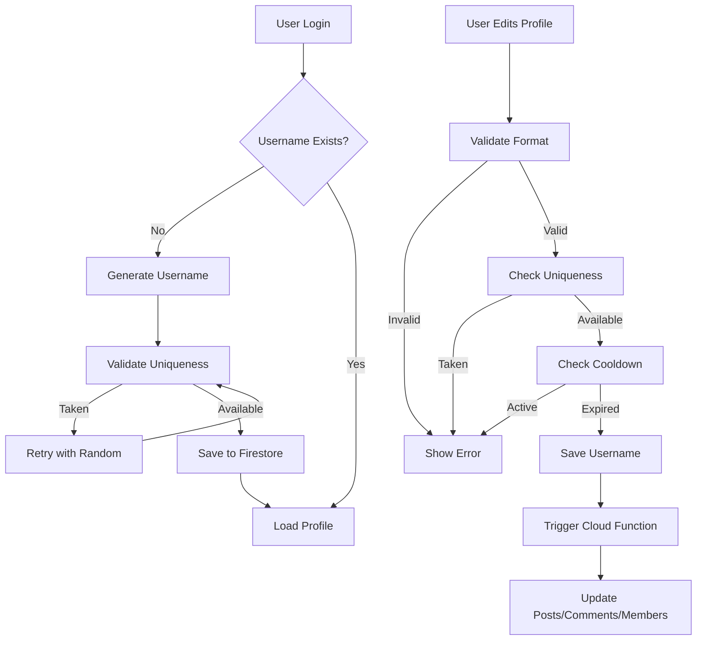

# Design Document: User Username System

## Overview

The User Username System introduces unique, user-friendly identifiers for all users in the Banka application. This feature replaces the current `displayName` (sourced from Google accounts) with a unique `username` field that users can customize within defined constraints. The system ensures username uniqueness through case-insensitive validation, provides automatic generation on first login, and enforces a 30-day cooldown period for username changes to prevent abuse.

### Key Design Goals

1. **Seamless Migration**: Existing users receive auto-generated usernames without disrupting their experience
2. **Uniqueness Guarantee**: Case-insensitive uniqueness enforced at database level with Firestore indexes
3. **User Control**: Users can customize their username with reasonable frequency limits
4. **Performance**: Denormalized username data in posts, comments, and group members for fast rendering
5. **Consistency**: Username propagation across all user-generated content through Cloud Functions

### Scope

**In Scope:**
- Username field addition to User entity
- Auto-generation logic for new and existing users
- Username validation (format and uniqueness)
- Profile editing UI with cooldown enforcement
- Replacement of displayName with username throughout the app
- Data migration for existing users
- Firestore indexing for efficient lookups
- Cloud Functions for propagating username changes

**Out of Scope:**
- Username history/audit trail
- Username reservation system
- Username marketplace/trading
- Custom username styling or badges
- Username mentions/tagging (future feature)

## Architecture

The implementation follows Clean Architecture principles with clear separation between layers:

```
Presentation Layer (UI)
  ↓
Domain Layer (Business Logic)
  ↓
Data Layer (Firebase Integration)
```

### Layer Responsibilities

**Presentation Layer:**
- Profile editing UI with username input field
- Real-time validation feedback
- Cooldown period display
- Username display throughout the app (replacing displayName)

**Domain Layer:**
- Username validation rules (format, length, character set)
- Uniqueness checking logic
- Cooldown period calculation
- Username generation algorithms

**Data Layer:**
- Firestore CRUD operations for user documents
- Batch updates for denormalized data
- Cloud Functions for async propagation
- Index management for efficient queries

### Data Flow Diagram



## Components and Interfaces

### 1. Domain Entities

#### UserProfile Entity (Modified)

```dart
@freezed
sealed class UserProfile with _$UserProfile {
  const factory UserProfile({
    required String id,
    required String displayName,  // Keep for backward compatibility
    required String username,     // NEW: Unique username
    required String usernameLowercase,  // NEW: For case-insensitive queries
    required String email,
    String? photoUrl,
    String? bio,
    DateTime? usernameLastChangedAt,  // NEW: For cooldown enforcement
    @Default(UserStats()) UserStats stats,
    @Default(<String>[]) List<String> fcmTokens,
    DateTime? createdAt,
    DateTime? updatedAt,
  }) = _UserProfile;
}
```

**New Fields:**
- `username`: The unique username (3-20 chars, alphanumeric + underscore)
- `usernameLowercase`: Lowercase version for case-insensitive uniqueness checks
- `usernameLastChangedAt`: Timestamp of last username change for cooldown enforcement

#### UsernameValidationResult (New)

```dart
@freezed
sealed class UsernameValidationResult with _$UsernameValidationResult {
  const factory UsernameValidationResult.valid() = _Valid;
  const factory UsernameValidationResult.invalid(String reason) = _Invalid;
  const factory UsernameValidationResult.taken() = _Taken;
  const factory UsernameValidationResult.cooldownActive({
    required DateTime nextAvailableDate,
  }) = _CooldownActive;
}
```

### 2. Domain Repositories

#### UserRepository (Extended)

```dart
abstract interface class UserRepository {
  // Existing methods...
  ResultFuture<UserProfile?> getUser(String userId);
  ResultStream<UserProfile?> watchUser(String userId);
  ResultFuture<void> updateUser(UserProfile user);
  
  // NEW: Username-specific methods
  ResultFuture<bool> isUsernameAvailable(String username);
  ResultFuture<String> generateUniqueUsername(String? displayName);
  ResultFuture<UsernameValidationResult> validateUsername(
    String username,
    String userId,
  );
  ResultFuture<void> updateUsername(
    String userId,
    String newUsername,
  );
}
```

### 3. Domain Use Cases

#### GenerateUsername (New)

```dart
@injectable
final class GenerateUsername implements UseCase<String, GenerateUsernameParams> {
  const GenerateUsername(this._repository);
  
  final UserRepository _repository;
  
  @override
  ResultFuture<String> call(GenerateUsernameParams params) async {
    // 1. Sanitize displayName (remove special chars, spaces)
    // 2. Check if sanitized name is available
    // 3. If taken, try with numbers (name1, name2, etc.)
    // 4. If all taken, generate random: user_XXXXXX
    // 5. Return unique username
  }
}

final class GenerateUsernameParams extends Equatable {
  const GenerateUsernameParams({this.displayName});
  
  final String? displayName;
  
  @override
  List<Object?> get props => [displayName];
}
```

**Generation Algorithm:**
1. If `displayName` provided:
   - Remove non-alphanumeric characters (except underscore)
   - Convert to lowercase
   - Truncate to 20 characters
   - Check availability
2. If unavailable, append numbers (1-999)
3. If all taken or no displayName, generate: `user_` + 6 random digits
4. Validate format and uniqueness
5. Return generated username

#### ValidateUsername (New)

```dart
@injectable
final class ValidateUsername implements UseCase<UsernameValidationResult, ValidateUsernameParams> {
  const ValidateUsername(this._repository);
  
  final UserRepository _repository;
  
  @override
  ResultFuture<UsernameValidationResult> call(ValidateUsernameParams params) async {
    // 1. Check format (length, characters, not starting with digit)
    // 2. Check uniqueness (case-insensitive)
    // 3. Check cooldown period (if updating existing username)
    // 4. Return validation result
  }
}

final class ValidateUsernameParams extends Equatable {
  const ValidateUsernameParams({
    required this.username,
    required this.userId,
    this.currentUsername,
  });
  
  final String username;
  final String userId;
  final String? currentUsername;
  
  @override
  List<Object?> get props => [username, userId, currentUsername];
}
```

**Validation Rules:**
1. Length: 3-20 characters
2. Characters: a-z, A-Z, 0-9, underscore (_)
3. Must not start with a digit
4. Must not be all digits
5. Case-insensitive uniqueness
6. Cooldown: 30 days between changes (except first change)

#### UpdateUsername (New)

```dart
@injectable
final class UpdateUsername implements UseCase<void, UpdateUsernameParams> {
  const UpdateUsername(this._repository);
  
  final UserRepository _repository;
  
  @override
  ResultFuture<void> call(UpdateUsernameParams params) async {
    // 1. Validate username
    // 2. Update user document
    // 3. Trigger Cloud Function for denormalized data update
  }
}

final class UpdateUsernameParams extends Equatable {
  const UpdateUsernameParams({
    required this.userId,
    required this.newUsername,
  });
  
  final String userId;
  final String newUsername;
  
  @override
  List<Object?> get props => [userId, newUsername];
}
```

### 4. Data Layer

#### UserRemoteDataSource (Extended)

```dart
abstract interface class UserRemoteDataSource {
  // Existing methods...
  Future<UserProfile?> getUser(String userId);
  Stream<UserProfile?> watchUser(String userId);
  Future<void> updateUser(UserProfile user);
  
  // NEW: Username-specific methods
  Future<bool> isUsernameAvailable(String username);
  Future<void> updateUsername(String userId, String newUsername);
  Future<UserProfile?> getUserByUsername(String username);
}
```

#### FirestoreUserRemoteDataSource (Implementation)

```dart
@LazySingleton(as: UserRemoteDataSource)
final class FirestoreUserRemoteDataSource implements UserRemoteDataSource {
  const FirestoreUserRemoteDataSource(this._firestore);
  
  final FirebaseFirestore _firestore;
  
  @override
  Future<bool> isUsernameAvailable(String username) async {
    final lowercase = username.toLowerCase();
    final query = await _firestore
        .collection('users')
        .where('usernameLowercase', isEqualTo: lowercase)
        .limit(1)
        .get();
    
    return query.docs.isEmpty;
  }
  
  @override
  Future<void> updateUsername(String userId, String newUsername) async {
    final userRef = _firestore.collection('users').doc(userId);
    
    await userRef.update({
      'username': newUsername,
      'usernameLowercase': newUsername.toLowerCase(),
      'usernameLastChangedAt': FieldValue.serverTimestamp(),
      'updatedAt': FieldValue.serverTimestamp(),
    });
  }
  
  @override
  Future<UserProfile?> getUserByUsername(String username) async {
    final lowercase = username.toLowerCase();
    final query = await _firestore
        .collection('users')
        .where('usernameLowercase', isEqualTo: lowercase)
        .limit(1)
        .get();
    
    if (query.docs.isEmpty) return null;
    
    return UserProfileDto.fromSnapshot(query.docs.first);
  }
}
```

### 5. Presentation Layer

#### ProfileBloc (Extended)

```dart
// New Events
sealed class ProfileEvent extends Equatable {
  const ProfileEvent();
}

final class ProfileUsernameChanged extends ProfileEvent {
  const ProfileUsernameChanged(this.username);
  final String username;
  
  @override
  List<Object> get props => [username];
}

final class ProfileUsernameValidationRequested extends ProfileEvent {
  const ProfileUsernameValidationRequested(this.username);
  final String username;
  
  @override
  List<Object> get props => [username];
}

final class ProfileSaveRequested extends ProfileEvent {
  const ProfileSaveRequested();
  
  @override
  List<Object> get props => [];
}

// New State fields
final class ProfileState extends Equatable {
  const ProfileState({
    this.profile,
    this.usernameValidation,
    this.isValidatingUsername = false,
    this.isSaving = false,
    this.error,
  });
  
  final UserProfile? profile;
  final UsernameValidationResult? usernameValidation;
  final bool isValidatingUsername;
  final bool isSaving;
  final String? error;
  
  @override
  List<Object?> get props => [
    profile,
    usernameValidation,
    isValidatingUsername,
    isSaving,
    error,
  ];
}
```

#### ProfileEditPage (Modified)

```dart
class ProfileEditPage extends StatelessWidget {
  const ProfileEditPage({super.key});
  
  @override
  Widget build(BuildContext context) {
    return Scaffold(
      appBar: AppBar(title: const Text('Редактировать профиль')),
      body: BlocBuilder<ProfileBloc, ProfileState>(
        builder: (context, state) {
          return ListView(
            padding: const EdgeInsets.all(16),
            children: [
              // Username field with validation
              TextFormField(
                decoration: InputDecoration(
                  labelText: 'Username',
                  hintText: 'user_name',
                  helperText: '3-20 символов: буквы, цифры, подчёркивание',
                  errorText: _getUsernameError(state.usernameValidation),
                  suffixIcon: state.isValidatingUsername
                      ? const CircularProgressIndicator()
                      : _getValidationIcon(state.usernameValidation),
                ),
                onChanged: (value) {
                  context.read<ProfileBloc>().add(
                    ProfileUsernameChanged(value),
                  );
                },
              ),
              
              // Cooldown warning
              if (state.usernameValidation is _CooldownActive)
                _buildCooldownWarning(
                  (state.usernameValidation as _CooldownActive).nextAvailableDate,
                ),
              
              // Other profile fields...
              
              // Save button
              ElevatedButton(
                onPressed: state.isSaving ? null : () {
                  context.read<ProfileBloc>().add(
                    const ProfileSaveRequested(),
                  );
                },
                child: const Text('Сохранить'),
              ),
            ],
          );
        },
      ),
    );
  }
  
  String? _getUsernameError(UsernameValidationResult? validation) {
    return validation?.when(
      valid: () => null,
      invalid: (reason) => reason,
      taken: () => 'Username уже занят',
      cooldownActive: (_) => 'Username можно изменить только раз в 30 дней',
    );
  }
  
  Widget? _getValidationIcon(UsernameValidationResult? validation) {
    return validation?.when(
      valid: () => const Icon(Icons.check_circle, color: Colors.green),
      invalid: (_) => const Icon(Icons.error, color: Colors.red),
      taken: () => const Icon(Icons.error, color: Colors.red),
      cooldownActive: (_) => const Icon(Icons.schedule, color: Colors.orange),
    );
  }
  
  Widget _buildCooldownWarning(DateTime nextAvailableDate) {
    final formatter = DateFormat('dd.MM.yyyy');
    return Container(
      padding: const EdgeInsets.all(12),
      margin: const EdgeInsets.only(top: 8),
      decoration: BoxDecoration(
        color: Colors.orange.withOpacity(0.1),
        borderRadius: BorderRadius.circular(8),
        border: Border.all(color: Colors.orange),
      ),
      child: Row(
        children: [
          const Icon(Icons.info_outline, color: Colors.orange),
          const SizedBox(width: 8),
          Expanded(
            child: Text(
              'Следующее изменение доступно: ${formatter.format(nextAvailableDate)}',
              style: const TextStyle(color: Colors.orange),
            ),
          ),
        ],
      ),
    );
  }
}
```

## Data Models

### Firestore Schema

#### users/{userId}

```json
{
  "id": "string",
  "displayName": "string",
  "username": "string",
  "usernameLowercase": "string",
  "email": "string",
  "photoUrl": "string?",
  "bio": "string?",
  "usernameLastChangedAt": "timestamp?",
  "stats": {
    "cansCount": "number",
    "likesReceived": "number",
    "groupsCount": "number",
    "avgRarity": "number",
    "topBrandId": "string?"
  },
  "fcmTokens": "string[]",
  "createdAt": "timestamp",
  "updatedAt": "timestamp"
}
```

**Indexes Required:**
- `usernameLowercase` (ascending) - for uniqueness checks and lookups
- Composite: `usernameLowercase` (ascending) + `createdAt` (descending) - for search with sorting

#### groups/{groupId}/members/{userId}

```json
{
  "userId": "string",
  "groupId": "string",
  "role": "string",
  "displayName": "string",
  "joinedAt": "timestamp"
}
```

**Migration:** `displayName` field will be updated to contain `username` instead of Google displayName.

#### posts/{postId}

```json
{
  "id": "string",
  "authorId": "string",
  "authorName": "string",
  "drinkName": "string",
  // ... other fields
}
```

**Migration:** `authorName` field will be updated from displayName to username.

#### posts/{postId}/comments/{commentId}

```json
{
  "id": "string",
  "authorId": "string",
  "authorName": "string",
  "text": "string",
  "createdAt": "timestamp"
}
```

**Migration:** `authorName` field will be updated from displayName to username.

### DTO Models

#### UserProfileDto (Modified)

```dart
abstract final class UserProfileDto {
  const UserProfileDto._();
  
  static UserProfile fromSnapshot(DocumentSnapshot<Map<String, dynamic>> doc) {
    final data = doc.data();
    if (data == null) {
      throw ServerException(message: 'User document ${doc.id} has no data');
    }
    
    return UserProfile(
      id: doc.id,
      displayName: data['displayName'] as String? ?? '',
      username: data['username'] as String? ?? '',
      usernameLowercase: data['usernameLowercase'] as String? ?? '',
      email: data['email'] as String? ?? '',
      photoUrl: data['photoUrl'] as String?,
      bio: data['bio'] as String?,
      usernameLastChangedAt: (data['usernameLastChangedAt'] as Timestamp?)?.toDate(),
      stats: UserStats(
        cansCount: data['stats']?['cansCount'] as int? ?? 0,
        likesReceived: data['stats']?['likesReceived'] as int? ?? 0,
        groupsCount: data['stats']?['groupsCount'] as int? ?? 0,
        avgRarity: (data['stats']?['avgRarity'] as num?)?.toDouble() ?? 0.0,
        topBrandId: data['stats']?['topBrandId'] as String?,
      ),
      fcmTokens: (data['fcmTokens'] as List<dynamic>?)
          ?.map((e) => e as String)
          .toList() ?? [],
      createdAt: (data['createdAt'] as Timestamp?)?.toDate(),
      updatedAt: (data['updatedAt'] as Timestamp?)?.toDate(),
    );
  }
  
  static Map<String, dynamic> toMap(UserProfile profile) {
    return {
      'displayName': profile.displayName,
      'username': profile.username,
      'usernameLowercase': profile.usernameLowercase,
      'email': profile.email,
      'photoUrl': profile.photoUrl,
      'bio': profile.bio,
      'usernameLastChangedAt': profile.usernameLastChangedAt != null
          ? Timestamp.fromDate(profile.usernameLastChangedAt!)
          : null,
      'stats': {
        'cansCount': profile.stats.cansCount,
        'likesReceived': profile.stats.likesReceived,
        'groupsCount': profile.stats.groupsCount,
        'avgRarity': profile.stats.avgRarity,
        'topBrandId': profile.stats.topBrandId,
      },
      'fcmTokens': profile.fcmTokens,
      'updatedAt': FieldValue.serverTimestamp(),
    };
  }
}
```

## Correctness Properties

*A property is a characteristic or behavior that should hold true across all valid executions of a system—essentially, a formal statement about what the system should do. Properties serve as the bridge between human-readable specifications and machine-verifiable correctness guarantees.*

Before writing correctness properties, I need to analyze the acceptance criteria for testability using the prework tool.


### Property Reflection

After analyzing all acceptance criteria, I've identified the following redundancies:

**Redundant Properties:**
1. Property from 5.5 (update usernameLastChangedAt) is redundant with 4.5 (update all three fields including usernameLastChangedAt)
2. Property from 8.6 (hide edit button for others) is the inverse of 8.5 (show edit button for self) - can be combined
3. Property from 9.2 (auto-update usernameLowercase) is redundant with 4.5 (update all three fields including usernameLowercase)

**Combined Properties:**
- Properties 6.1-6.5 (username display in various UI components) can be combined into a single comprehensive property about username rendering
- Properties 8.5-8.6 (edit button visibility) can be combined into one property about conditional rendering

**Final Property Set:**
After eliminating redundancies, we have the following unique, testable properties:

### Property 1: Generated Username Format Invariant

*For any* user registration or migration, the generated username SHALL match the format: 3-20 characters, containing only letters (a-z, A-Z), digits (0-9), and underscore (_), not starting with a digit, and not consisting only of digits.

**Validates: Requirements 1.5**

### Property 2: Username Generation from DisplayName

*For any* valid displayName, the username generator SHALL produce a username by sanitizing the displayName (removing invalid characters, converting to lowercase) or falling back to "user_XXXXXX" format if the sanitized name is unavailable.

**Validates: Requirements 1.1, 1.2**

### Property 3: Username Uniqueness Guarantee

*For any* username generation or update attempt, the system SHALL verify uniqueness through case-insensitive comparison before allowing the operation to proceed.

**Validates: Requirements 1.3, 3.1, 3.2**

### Property 4: Username Persistence Round-Trip

*For any* username that is generated or updated, saving it to the repository and reading it back SHALL return the same username value along with correctly populated usernameLowercase and usernameLastChangedAt fields.

**Validates: Requirements 1.4, 4.5, 9.1**

### Property 5: Format Validation Rules

*For any* input string, the username validator SHALL correctly identify whether it meets all format requirements: length 3-20, valid character set, not starting with digit, not all digits.

**Validates: Requirements 2.1, 2.2, 2.3, 2.4**

### Property 6: Validation Error Messages

*For any* invalid username input, the validator SHALL return an appropriate error message describing the specific rule violation.

**Validates: Requirements 2.5, 3.3**

### Property 7: Current Username Preservation

*For any* user attempting to save their profile with their existing username unchanged, the validation SHALL succeed regardless of uniqueness checks.

**Validates: Requirements 3.4**

### Property 8: Cooldown Period Enforcement

*For any* username change attempt, if usernameLastChangedAt is not null and less than 30 days (2,592,000 seconds) have elapsed, the system SHALL reject the change with a cooldown error.

**Validates: Requirements 4.3, 4.4, 5.2, 5.3**

### Property 9: First Change Allowance

*For any* user with usernameLastChangedAt = null, username change attempts SHALL be allowed without cooldown restrictions.

**Validates: Requirements 5.4**

### Property 10: Timestamp Update on Change

*For any* successful username change, the usernameLastChangedAt field SHALL be updated to the current timestamp.

**Validates: Requirements 5.1**

### Property 11: Username Display Consistency

*For any* UI component displaying user information (GroupMember list, Comment, Post, Profile, Search results), the username SHALL be displayed instead of displayName, with displayName as fallback when username is not set.

**Validates: Requirements 6.1, 6.2, 6.3, 6.4, 6.5, 6.6**

### Property 12: Migration Trigger on Login

*For any* user login where the username field is absent or empty, the system SHALL automatically generate and save a username.

**Validates: Requirements 7.1, 7.2**

### Property 13: Profile Edit Button Visibility

*For any* user viewing a profile page, the edit button SHALL be visible if and only if the profile belongs to the current user.

**Validates: Requirements 8.5, 8.6**

### Property 14: Chronological Post Ordering

*For any* set of user posts displayed on the profile page, they SHALL be ordered chronologically (newest first).

**Validates: Requirements 8.2**

### Property 15: Stats Display Completeness

*For any* user profile page, all statistics (cansCount, likesReceived, groupsCount, avgRarity, topBrandId) SHALL be displayed.

**Validates: Requirements 8.3, 8.4**

### Property 16: Prefix Search Functionality

*For any* username prefix query, the search SHALL return all usernames that start with that prefix (case-insensitive).

**Validates: Requirements 9.5**

### Property 17: Batch Operation Splitting

*For any* username change affecting more than 500 GroupMember documents, the update operation SHALL be split into multiple batches of at most 500 operations each.

**Validates: Requirements 11.4**

### Property 18: Denormalized Data Persistence

*For any* post or comment creation, the author's username SHALL be stored in the authorName field of the document.

**Validates: Requirements 12.1, 12.2**

## Error Handling

### Error Types

The system defines the following error types for username operations:

```dart
sealed class UsernameFailure extends Failure {
  const UsernameFailure({required super.message});
}

final class InvalidFormatFailure extends UsernameFailure {
  const InvalidFormatFailure({required super.message});
}

final class UsernameTakenFailure extends UsernameFailure {
  const UsernameTakenFailure()
      : super(message: 'Username уже занят, выберите другой');
}

final class CooldownActiveFailure extends UsernameFailure {
  const CooldownActiveFailure({
    required this.nextAvailableDate,
  }) : super(
          message: 'Username можно изменить только раз в 30 дней',
        );
  
  final DateTime nextAvailableDate;
}

final class GenerationFailedFailure extends UsernameFailure {
  const GenerationFailedFailure()
      : super(
          message: 'Не удалось сгенерировать username, попробуйте позже',
        );
}
```

### Error Handling Strategy

**Validation Errors:**
- Display inline in the profile edit form
- Show specific error message based on validation result
- Prevent form submission until errors are resolved

**Cooldown Errors:**
- Display warning banner with next available date
- Disable username field if cooldown is active
- Show countdown timer for user awareness

**Generation Errors:**
- Retry with exponential backoff (up to 10 attempts)
- Log generation failures for monitoring
- Fall back to random generation if displayName-based generation fails
- Show error to user only if all generation attempts fail

**Network Errors:**
- Wrap all Firestore operations in try-catch
- Convert FirebaseException to appropriate Failure types
- Show user-friendly error messages
- Provide retry mechanism for transient failures

### Error Recovery

**Optimistic UI Updates:**
- Update UI immediately on username change
- Revert on error with error message
- Maintain previous state for rollback

**Partial Failure Handling:**
- If batch update fails mid-operation, log affected documents
- Cloud Function retries ensure eventual consistency
- User sees success message after local update completes
- Background propagation continues asynchronously

## Testing Strategy

### Unit Testing

**Domain Layer Tests:**
- Username validation logic (format, length, character set)
- Cooldown calculation logic
- Username generation algorithms
- Use case orchestration

**Data Layer Tests:**
- DTO serialization/deserialization
- Repository error mapping (Exception → Failure)
- Mock Firestore interactions

**Presentation Layer Tests:**
- BLoC event handling and state transitions
- Widget tests for profile edit UI
- Validation feedback display

### Property-Based Testing

The system uses property-based testing to verify universal properties across many generated inputs. Each property test runs a minimum of 100 iterations with randomized data.

**Test Framework:** `dart_check` (Dart's property-based testing library)

**Property Test Examples:**

```dart
// Property 1: Generated Username Format Invariant
test('generated usernames always match format requirements', () {
  check(
    any.displayName,
    (displayName) {
      final username = generateUsername(displayName);
      expect(username.length, inRange(3, 20));
      expect(username, matches(r'^[a-zA-Z_][a-zA-Z0-9_]*$'));
      expect(username, isNot(matches(r'^\d+$')));
    },
    iterations: 100,
  );
}, tags: ['Feature: user-username-system, Property 1: Generated Username Format Invariant']);

// Property 4: Username Persistence Round-Trip
test('username round-trip preserves all fields', () {
  check(
    any.username.and(any.userId),
    (username, userId) async {
      await repository.updateUsername(userId, username);
      final user = await repository.getUser(userId);
      
      expect(user?.username, equals(username));
      expect(user?.usernameLowercase, equals(username.toLowerCase()));
      expect(user?.usernameLastChangedAt, isNotNull);
    },
    iterations: 100,
  );
}, tags: ['Feature: user-username-system, Property 4: Username Persistence Round-Trip']);

// Property 8: Cooldown Period Enforcement
test('cooldown enforced for changes within 30 days', () {
  check(
    any.userId.and(any.recentTimestamp),
    (userId, lastChanged) async {
      final daysSince = DateTime.now().difference(lastChanged).inDays;
      final result = await repository.updateUsername(userId, 'newname');
      
      if (daysSince < 30) {
        expect(result.isLeft(), isTrue);
        result.fold(
          (failure) => expect(failure, isA<CooldownActiveFailure>()),
          (_) => fail('Should have failed with cooldown'),
        );
      } else {
        expect(result.isRight(), isTrue);
      }
    },
    iterations: 100,
  );
}, tags: ['Feature: user-username-system, Property 8: Cooldown Period Enforcement']);
```

**Generator Definitions:**

```dart
extension UsernameGenerators on Arbitrary {
  Arbitrary<String> get username => string(
    minLength: 3,
    maxLength: 20,
    codeUnits: CodeUnits.alphanumeric.union(CodeUnits.of('_')),
  ).suchThat((s) => !s.startsWith(RegExp(r'\d')) && !s.matches(RegExp(r'^\d+$')));
  
  Arbitrary<String> get displayName => string(
    minLength: 1,
    maxLength: 50,
    codeUnits: CodeUnits.unicode,
  );
  
  Arbitrary<DateTime> get recentTimestamp => dateTime(
    min: DateTime.now().subtract(const Duration(days: 60)),
    max: DateTime.now(),
  );
}
```

### Integration Testing

**Firestore Integration:**
- Test actual Firestore queries with test database
- Verify index usage for username lookups
- Test batch operations with realistic data volumes
- Verify Cloud Function triggers and execution

**End-to-End Scenarios:**
- New user registration flow
- Username change with cooldown
- Migration of existing users
- Search functionality with various queries

### Manual Testing

**User Acceptance Testing:**
- Profile editing workflow
- Error message clarity
- Cooldown period display
- Username display across all screens

**Performance Testing:**
- Batch update performance with 1000+ documents
- Search response time with 10,000+ users
- Cloud Function execution time

## Cloud Functions

### Function: onUsernameChanged

**Trigger:** Firestore document update on `users/{userId}` where `username` field changes

**Purpose:** Propagate username changes to all denormalized data (posts, comments, group members)

**Implementation:**

```javascript
exports.onUsernameChanged = functions
  .region('europe-west3')
  .firestore
  .document('users/{userId}')
  .onUpdate(async (change, context) => {
    const before = change.before.data();
    const after = change.after.data();
    const userId = context.params.userId;
    
    // Check if username actually changed
    if (before.username === after.username) {
      return null;
    }
    
    const newUsername = after.username;
    console.log(`Username changed for ${userId}: ${before.username} -> ${newUsername}`);
    
    // Update posts
    const postsSnapshot = await admin.firestore()
      .collection('posts')
      .where('authorId', '==', userId)
      .get();
    
    // Update comments (across all posts)
    const commentsQuery = await admin.firestore()
      .collectionGroup('comments')
      .where('authorId', '==', userId)
      .get();
    
    // Update group members
    const membersQuery = await admin.firestore()
      .collectionGroup('members')
      .where('userId', '==', userId)
      .get();
    
    // Batch updates (max 500 per batch)
    const allDocs = [
      ...postsSnapshot.docs,
      ...commentsQuery.docs,
      ...membersQuery.docs,
    ];
    
    const batches = [];
    for (let i = 0; i < allDocs.length; i += 500) {
      const batch = admin.firestore().batch();
      const chunk = allDocs.slice(i, i + 500);
      
      chunk.forEach(doc => {
        batch.update(doc.ref, {
          authorName: newUsername,
          displayName: newUsername, // For GroupMember compatibility
        });
      });
      
      batches.push(batch.commit());
    }
    
    await Promise.all(batches);
    
    console.log(`Updated ${allDocs.length} documents for user ${userId}`);
    return null;
  });
```

**Error Handling:**
- Retry on transient Firestore errors (built-in by Cloud Functions)
- Log errors for monitoring
- Eventual consistency - function will retry until successful

**Performance Considerations:**
- Batch operations for efficiency
- Parallel batch commits
- Indexed queries for fast lookups
- Estimated execution time: ~2-5 seconds for 1000 documents

### Function: generateUsernameOnSignup

**Trigger:** Firestore document create on `users/{userId}`

**Purpose:** Generate username for new users if not already set

**Implementation:**

```javascript
exports.generateUsernameOnSignup = functions
  .region('europe-west3')
  .firestore
  .document('users/{userId}')
  .onCreate(async (snapshot, context) => {
    const data = snapshot.data();
    const userId = context.params.userId;
    
    // Skip if username already set
    if (data.username && data.username.trim() !== '') {
      return null;
    }
    
    const displayName = data.displayName || '';
    let username = sanitizeDisplayName(displayName);
    
    // Check uniqueness and generate alternative if needed
    let attempts = 0;
    while (attempts < 10) {
      const exists = await isUsernameTaken(username);
      if (!exists) {
        break;
      }
      
      // Try with number suffix
      if (attempts < 3) {
        username = `${sanitizeDisplayName(displayName)}${attempts + 1}`;
      } else {
        // Fall back to random
        username = `user_${Math.floor(100000 + Math.random() * 900000)}`;
      }
      
      attempts++;
    }
    
    if (attempts >= 10) {
      console.error(`Failed to generate username for ${userId} after 10 attempts`);
      return null;
    }
    
    // Update user document
    await snapshot.ref.update({
      username: username,
      usernameLowercase: username.toLowerCase(),
    });
    
    console.log(`Generated username ${username} for user ${userId}`);
    return null;
  });

function sanitizeDisplayName(displayName) {
  return displayName
    .toLowerCase()
    .replace(/[^a-z0-9_]/g, '')
    .substring(0, 20)
    .replace(/^[0-9]+/, '') // Remove leading digits
    || `user_${Math.floor(100000 + Math.random() * 900000)}`;
}

async function isUsernameTaken(username) {
  const snapshot = await admin.firestore()
    .collection('users')
    .where('usernameLowercase', '==', username.toLowerCase())
    .limit(1)
    .get();
  
  return !snapshot.empty;
}
```

## Firestore Security Rules

```javascript
rules_version = '2';
service cloud.firestore {
  match /databases/{database}/documents {
    // Users collection
    match /users/{userId} {
      // Anyone can read user profiles
      allow read: if true;
      
      // Only the user can update their own profile
      allow update: if request.auth != null 
        && request.auth.uid == userId
        && validateUsernameUpdate(request.resource.data, resource.data);
      
      // Username validation function
      function validateUsernameUpdate(newData, oldData) {
        // Username format validation
        let usernameValid = newData.username.size() >= 3 
          && newData.username.size() <= 20
          && newData.username.matches('^[a-zA-Z_][a-zA-Z0-9_]*$');
        
        // usernameLowercase must match username.toLowerCase()
        let lowercaseValid = newData.usernameLowercase == newData.username.lower();
        
        // If username changed, check cooldown
        let usernameChanged = newData.username != oldData.username;
        let cooldownValid = !usernameChanged 
          || !exists(/databases/$(database)/documents/users/$(userId))
          || oldData.usernameLastChangedAt == null
          || (request.time.toMillis() - oldData.usernameLastChangedAt.toMillis()) > 2592000000; // 30 days in ms
        
        return usernameValid && lowercaseValid && cooldownValid;
      }
    }
  }
}
```

**Security Considerations:**
- Username uniqueness enforced at application level (not in rules due to query limitations)
- Cooldown period enforced in rules to prevent client-side bypass
- Format validation in rules as defense-in-depth
- Read access public for social features

## Firestore Indexes

### Required Indexes

**firestore.indexes.json:**

```json
{
  "indexes": [
    {
      "collectionGroup": "users",
      "queryScope": "COLLECTION",
      "fields": [
        {
          "fieldPath": "usernameLowercase",
          "order": "ASCENDING"
        }
      ]
    },
    {
      "collectionGroup": "users",
      "queryScope": "COLLECTION",
      "fields": [
        {
          "fieldPath": "usernameLowercase",
          "order": "ASCENDING"
        },
        {
          "fieldPath": "createdAt",
          "order": "DESCENDING"
        }
      ]
    },
    {
      "collectionGroup": "members",
      "queryScope": "COLLECTION_GROUP",
      "fields": [
        {
          "fieldPath": "userId",
          "order": "ASCENDING"
        }
      ]
    },
    {
      "collectionGroup": "comments",
      "queryScope": "COLLECTION_GROUP",
      "fields": [
        {
          "fieldPath": "authorId",
          "order": "ASCENDING"
        }
      ]
    }
  ]
}
```

**Index Purposes:**
1. `usernameLowercase` (single field) - Uniqueness checks and exact lookups
2. `usernameLowercase + createdAt` (composite) - Search with sorting
3. `members.userId` (collection group) - Find all group memberships for username propagation
4. `comments.authorId` (collection group) - Find all comments for username propagation

## Migration Strategy

### Phase 1: Schema Update (Non-Breaking)

1. Add new fields to UserProfile entity
2. Update DTOs to handle new fields with defaults
3. Deploy application code
4. Existing users continue working with displayName

### Phase 2: Data Migration

**Option A: Lazy Migration (Recommended)**
- Generate username on next login for users without username
- Implemented in `generateUsernameOnSignup` Cloud Function
- Zero downtime, gradual rollout
- Estimated completion: 2-4 weeks based on user activity

**Option B: Batch Migration**
- Run migration script to update all users at once
- Higher risk, requires maintenance window
- Faster completion: 1-2 hours

**Migration Script (if needed):**

```javascript
const admin = require('firebase-admin');
admin.initializeApp();

async function migrateUsers() {
  const usersSnapshot = await admin.firestore()
    .collection('users')
    .where('username', '==', '')
    .get();
  
  console.log(`Migrating ${usersSnapshot.size} users`);
  
  for (const doc of usersSnapshot.docs) {
    const data = doc.data();
    const username = await generateUniqueUsername(data.displayName);
    
    await doc.ref.update({
      username: username,
      usernameLowercase: username.toLowerCase(),
    });
    
    console.log(`Migrated user ${doc.id}: ${username}`);
  }
  
  console.log('Migration complete');
}

migrateUsers().catch(console.error);
```

### Phase 3: UI Update

1. Update all UI components to display username
2. Add fallback to displayName for unmigrated users
3. Deploy UI changes
4. Monitor for issues

### Phase 4: Denormalized Data Update

1. Deploy `onUsernameChanged` Cloud Function
2. Function automatically updates posts/comments/members as users change usernames
3. For initial migration, run batch update script if needed

### Rollback Plan

If issues arise:
1. Revert application code to previous version
2. Username fields remain in database (no data loss)
3. Application falls back to displayName
4. Fix issues and redeploy

## Performance Considerations

### Query Optimization

**Username Lookups:**
- Single-field index on `usernameLowercase` ensures O(log n) lookups
- Estimated query time: <50ms for 100,000 users

**Prefix Search:**
- Use `startAt` and `endAt` with `usernameLowercase` index
- Limit results to 20 for autocomplete
- Estimated query time: <100ms

**Batch Updates:**
- 500 operations per batch (Firestore limit)
- Parallel batch commits for speed
- Estimated time: ~5 seconds for 1000 documents

### Caching Strategy

**Client-Side:**
- Cache user profiles in memory (BLoC state)
- Invalidate cache on username change
- Reduce redundant Firestore reads

**Server-Side:**
- Cloud Functions have warm instances (reduce cold starts)
- No explicit caching needed for username lookups (Firestore is fast enough)

### Scalability

**Current Scale:**
- Expected users: 1,000-10,000 in first year
- Expected posts: 10,000-100,000
- Expected comments: 50,000-500,000

**Scaling Considerations:**
- Firestore scales automatically
- Cloud Functions scale horizontally
- Batch operations handle large datasets efficiently
- Consider sharding if users exceed 1 million

## Monitoring and Observability

### Metrics to Track

**Application Metrics:**
- Username generation success rate
- Username validation failure rate (by reason)
- Cooldown rejection rate
- Average username change frequency

**Performance Metrics:**
- Username lookup latency (p50, p95, p99)
- Batch update duration
- Cloud Function execution time
- Cloud Function error rate

**Business Metrics:**
- Percentage of users with custom usernames
- Username change frequency
- Most common username patterns

### Logging

**Application Logs:**
```dart
logger.info('Username generated', {
  'userId': userId,
  'username': username,
  'source': 'displayName|random',
});

logger.warning('Username validation failed', {
  'userId': userId,
  'username': username,
  'reason': 'format|taken|cooldown',
});

logger.error('Username generation failed', {
  'userId': userId,
  'attempts': attempts,
});
```

**Cloud Function Logs:**
```javascript
console.log('Username changed', {
  userId,
  oldUsername,
  newUsername,
  documentsUpdated: allDocs.length,
  duration: Date.now() - startTime,
});
```

### Alerts

**Critical Alerts:**
- Username generation failure rate > 5%
- Cloud Function error rate > 1%
- Batch update duration > 30 seconds

**Warning Alerts:**
- Username validation failure rate > 20%
- Cooldown rejection rate > 10%
- Cloud Function cold start rate > 50%

## Future Enhancements

### Phase 2 Features (Out of Current Scope)

1. **Username History:**
   - Track previous usernames
   - Display username change history on profile
   - Prevent reuse of recently used usernames

2. **Username Mentions:**
   - @username tagging in comments
   - Notifications for mentions
   - Autocomplete for mentions

3. **Username Verification:**
   - Verified badge for notable users
   - Verification request workflow
   - Admin approval process

4. **Username Marketplace:**
   - Allow users to claim premium usernames
   - Username trading/transfer
   - Reserved username list

5. **Advanced Search:**
   - Full-text search with Algolia/Typesense
   - Fuzzy matching for typos
   - Search by username similarity

6. **Username Analytics:**
   - Popular username patterns
   - Username availability heatmap
   - Suggestion engine for available usernames

## Conclusion

The User Username System provides a robust, scalable solution for unique user identification in the Banka application. The design follows Clean Architecture principles, ensures data consistency through careful denormalization and Cloud Functions, and provides a smooth user experience with automatic generation and reasonable customization options.

Key strengths of this design:
- **Zero-downtime migration** through lazy username generation
- **Strong consistency** through Firestore transactions and indexes
- **Performance** through denormalization and efficient batch operations
- **User control** with reasonable limits (30-day cooldown)
- **Scalability** through Cloud Functions and Firestore's automatic scaling

The implementation can be completed in 2-3 sprints with proper testing and monitoring in place.
